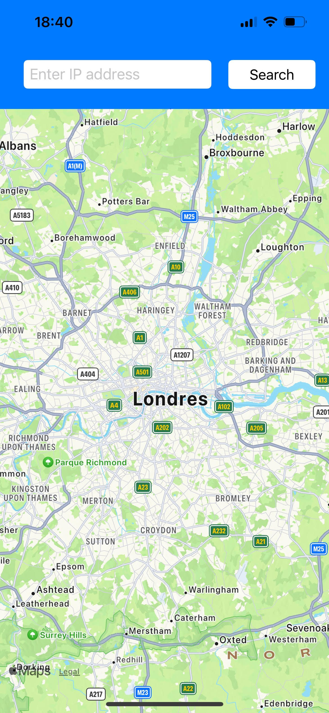

# IP Tracker App

## Description
This is an IP Tracker App developed using SwiftUI. It allows users to enter an IP address, searches for its geolocation, and displays the location on a map along with relevant information such as the IP address, timezone, city, country, and ISP details.

## Features
- Enter an IP address in the search bar.
- View the geolocation on a map.
- Display details about the IP address, including timezone, city, country, and ISP.
  
## Screenshots

## Installation
Clone the repository to your local machine:
